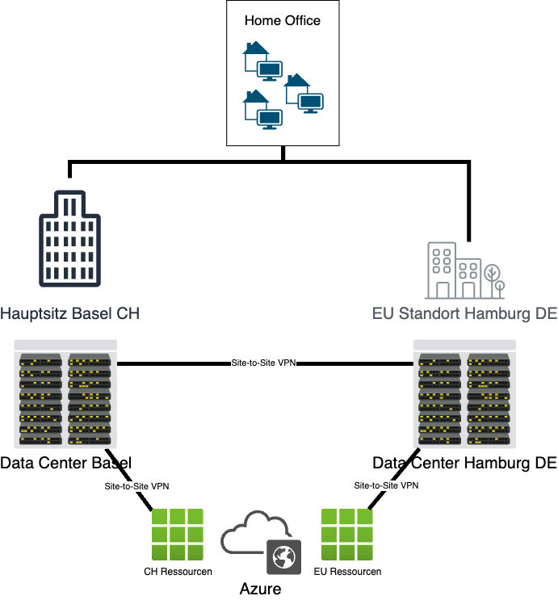
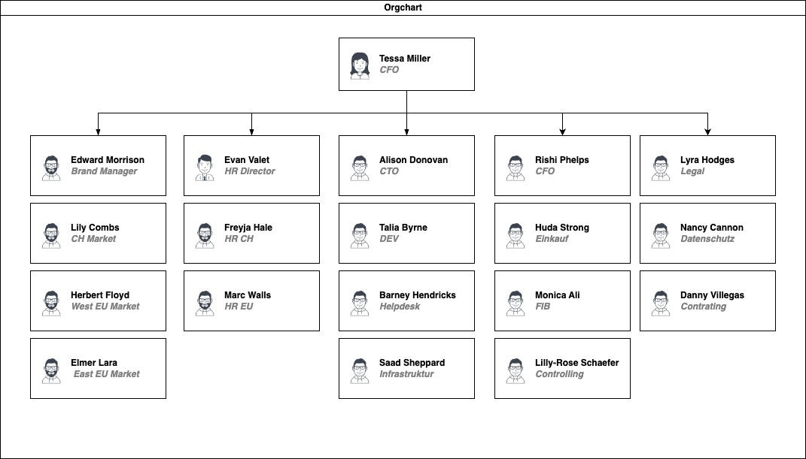

# 1. Daten AG
:::info

Fake-Firma der Fallstudie

:::

## Beschreibung

Die Daten AG ist eine Aktiengesellschaft, welche sich mit dem zentralen Speichern von Patientenakten für Gesundheitseinrichtungen beschäftigt. Dabei bieten sie Software- und Hardwarelösungen an. Das Unternehmen ist national und EU weit tätig.
Die Daten AG beschäftigt am Hauptsitzt in Basel CH ca. 500 Mitarbeitende und in der Niederlassung in Hamburg DE nochmals ca. 200 Mitarbeitende.
Die Mitarbeiter:innen arbeiten grundsätzlich an Shared Desks in den Standorten, haben aber ebenfalls die Möglichkeit bis zu 40% im Home-Office zu arbeiten. Die Kadermitarbeitenden verfügen über eigene Büros.
Das Unternehmen verfügt über ein Data Center in Basel, sowie ein Data Center in Hamburg und hat Ressourcen bei Azure und AWS.

## Organigramm
Die Firma ist wie folgt strukturiert:

## EDV-Infrastruktur
Im Unternehmen verfügen alle Mitarbeitenden über ein Notebook sowie ein Firmen Smart-Phone und der Vertrieb noch über ein Tablet. Die Geräte werden zentral vom Helpdesk gemanagt. Die Daten der Firma sind in Onedrive, sowie auf dem zentralen File Server gespeichert.

## Produkte - Software
Das Unternehmen hat zwei Produkte. Zum einen vertreiben sie eine Software, welche von den Gesundheitseinrichtungen gekauft und individualisiert werden kann. Zum anderen bieten sie eine Cloud-Anwendung, welche als SaaS-Lösung von den Kund:innen bezogen werden kann.

*Datenbank*
- Mitarbeitende (Name, Adresse, Geb.-Datum, Geschlecht, IBAN, AHV-Nr.)
- Patient:innen (Name, Adresse, Geb.-Datum, Geschlecht, AHV-Nr., Krankenkassen-Angaben, Blutguppe)
- Dossier von Patient:innen (Angaben zum Gesundheitszustand, Referenzen zu Dateien auf File Server z.B. Röntgenbild)
- Kontakte (Name, Adresse, Tel, E-Mail, Webseite)
- Inventar
- Login-Daten von Kund:innen und Mitarbeiter:innen ( User, Password)
- Rollen in Applikation z.B. Arzt/Ärztin oder Patient:in
- Gruppen 

*File Server*
- Röntgenbild
- Impfausweis
- Laborberichte
- Rechnungen
- Lohnausweise
- Lieferscheine

### OnPrem Infrastruktur
Die Daten der Software sind lokal auf dem Datenbank-Server und File-Server der Kund:innen gespeichert. Sie werden auf dem Applikations-Server bei den Kund:innen verarbeitet. Der Zugriff auf die Applikation ist intern und/oder extern via Web-Server hinter der Firewall der Kund:innen möglich.

### Cloud Infrastruktur - Shared
Die Infrastruktur der SaaS-Lösung ist geteilt mit anderen Kund:innen. Die Datenbank, sowie Daten werden im Azure Tanent unser Firma gespeichert. Der Zugriff erfolgt jeweils via Webseite hinter der WAF von Azure.

