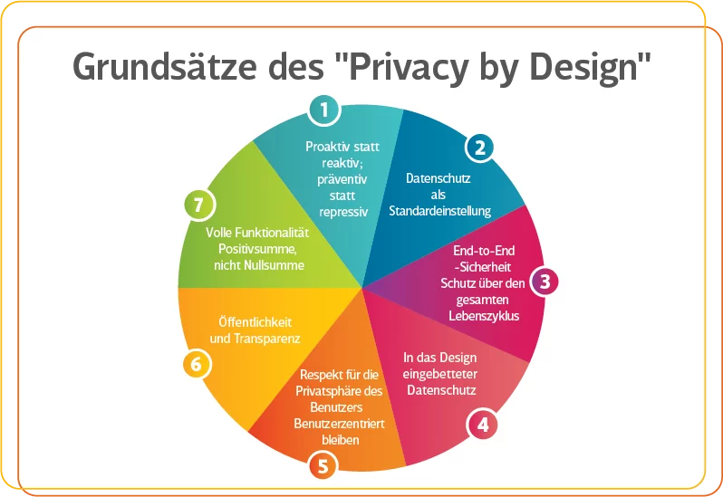

---
keywords:
  - pdf
---

# Schweiz DSG

Welche Gesetzte gibt es in der Schweiz zum Thema Datenschutz und was bedeuten
diese für uns als Informatiker.

## 🎉 Celebration Criteria

1. **Kategorisiert Daten aufgrund ihres Schutzbedarfs.**

    - :dart: Kennt verschiedene Rechtsräume (Schweiz, EU).
    - :dart: Kennt für den jeweiligen Rechtsraum die juristischen Werke (z. B. DSG,
      DSGVO).

2. **Überprüft eingesetzte Anwendungen auf Einhaltung der Datenschutzgesetze.**

    - :dart: Kennt wesentliche Unterschiede in den Datenschutzgesetzen der
      verschiedenen Rechtsräume.

3. **Zeigt Konsequenzen von Fehlern im Datenschutz und bei der Datensicherheit auf.**

    - :dart: Kennt die Problematik von Datenlöschungen über alle Archive und
      Backups.

## :compass: Wegweiser

  
 🤔 Leitfragen 

- Wer muss sich an das Gesetz halten?
- Wer ist unter dem Gesetzt geschützt?
- Was ist ein Juristisch respektive Natürliche Person?
- Welche Daten sind geschützt?
- Was sind besonders schützenswerte Daten?
- Was muss bei besonders schützenswerten Daten beachte werden?
- Was ist eine Datensammlung?
- Welche Rechte hat eine betroffene Person?
- Wie kann ich als betroffene Person gebrauch vom Gesetzt machen?
- Welche Pflichten hat eine Firma oder öffentliche Institution?
- Was sind die Konsequenzen von Verstössen?
- Was sind die Unterschiede der Gesetzte?
- Was bedeute das Gesetzt für euch als Mitarbeiter, IT-Mitarbeiter respektive
  Entwickler?
- Was ist privacy by design und privacy by default?
- Was bedeute das Gesetz bei der Evaluation von Anwendungen?
- Was für Problem können bei SAAS (Cloud) Anwendungen entstehen?
- ...

  
 ℹ️ Quellen für die Recherche

- [**CH EDÖB:** Datenschutz](https://www.edoeb.admin.ch/edoeb/de/home/datenschutz/ueberblick/datenschutz.html)

- [**CH:** DSG](https://www.fedlex.admin.ch/eli/fga/2020/1998/de)

- [**CH:** Art. 13 der Bundesverfassung](https://www.fedlex.admin.ch/eli/cc/1999/404/de#a13)

- [**CH:** Verordnung zum Bundesgesetz über den Datenschutz](https://www.fedlex.admin.ch/eli/cc/1993/1962_1962_1962/de)

- [**CH:** Art. 28-28l Zivilgesetzbuches (ZGB)](https://www.fedlex.admin.ch/eli/cc/24/233_245_233/de#a28)

- [**KMU CH Admin:** revDSG](https://www.kmu.admin.ch/kmu/de/home/fakten-trends/digitalisierung/datenschutz/neues-datenschutzgesetz-rev-dsg.html)

- [**Hostpoint:** Blog](https://www.hostpoint.ch/blog/das-neue-datenschutzgesetz-kommt-2023-was-gilt-es-dabei-zu-beachten/)

## Information

### Einstig ins Thema

#### Was ist Datenschutz?

Gesetzliche vorschriften zum Schutz von personenbezogen Daten.

:paperclip:
[Bildquelle](https://cdn.netzpolitik.org/wp-upload/privacygollum.jpg)

#### Was ist das Ziel des Datenschutzes?

Das die Privatsphäre von Naturlichenperson bei der Verarbeitung von Daten
respektiert wird.

:paperclip:
[Bildquelle](https://www.esendex.co.uk/wp-content/uploads/images/esendex-uk/website/dataprocessinggdpr.jpg)

#### Was ist "privacy by design"?

Der Datenschutz als Design Grundsatz beim Planen und Umsetzten von Infrastruktur
und Software genommen. z.B. werden nur die absolut notwenigen Daten erhoben

:paperclip:
[Bildquelle](https://www.2b-advice.com/wp-content/uploads/2022/07/26_Principles-of-Privacy-by-Design_DE.png)

#### Was ist "privacy by default"?

Wen es eine Wahl gibt wird die Datenschutz freundlichst Variante als Standart
gesetzt. z.B. Cookies etc. bei den Webseiten

:paperclip:
[Bildquelle](https://user-images.githubusercontent.com/38752255/93235175-7ab6e280-f77d-11ea-9b8a-5a8c144344d7.gif)

---

### DSG Kompakt

#### Gesetzt in der Schweiz

##### Art. 13 Schutz der Privatsphäre

> 1 Jede Person hat Anspruch auf Achtung ihres Privat- und Familienlebens, ihrer
> Wohnung sowie ihres Brief-, Post- und Fernmeldeverkehrs. 2 Jede Person hat
> Anspruch auf Schutz vor Missbrauch ihrer persönlichen Daten.

[**CH:** Art. 13 der Bundesverfassung](https://www.fedlex.admin.ch/eli/cc/1999/404/de#a13)

#### Datenschutz Gesetz

Art. 1 Zweck Dieses Gesetz bezweckt den Schutz der Persönlichkeit und der
Grundrechte von natürlichen Personen, über die Personendaten bearbeitet werden.

[**CH:** DSG](https://www.fedlex.admin.ch/eli/fga/2020/1998/de)

#### Rechte von Betroffenen

- Art. 25 Auskunftsrecht

1. Jede Person kann vom Verantwortlichen Auskunft darüber verlangen, ob
   Personendaten über sie bearbeitet werden. ...

- Art. 26 Einschränkungen des Auskunftsrechts

- Art. 27 Einschränkungen des Auskunftsrechts für Medien

- Art. 28 Recht auf Datenherausgabe oder -übertragung

1. Jede Person kann vom Verantwortlichen die Herausgabe ihrer Personendaten, die
   sie ihm bekanntgegeben hat, in einem gängigen elektronischen Format
   verlangen, wenn:

   a. der Verantwortliche die Daten automatisiert bearbeitet; und

   b. die Daten mit der Einwilligung der betroffenen Person oder in
   unmittelbarem Zusammenhang mit dem Abschluss oder der Abwicklung eines
   Vertrags zwischen dem Verantwortlichen und der betroffenen Person bearbeitet
   werden.

- Art. 29 Einschränkungen des Rechts auf Datenherausgabe oder -übertragung

#### Pflicht von Unternehmen

- Art. 6 Grundsätze

1. Personendaten müssen rechtmässig bearbeitet werden.
2. Die Bearbeitung muss nach Treu und Glauben erfolgen und verhältnismässig
   sein.
3. Personendaten dürfen nur zu einem bestimmten und für die betroffene Person
   erkennbaren Zweck beschafft werden; sie dürfen nur so bearbeitet werden, dass
   es mit diesem Zweck vereinbar ist. ...

- Art. 7 Datenschutz durch Technik und datenschutzfreundliche Voreinstellungen

- Art. 8 Datensicherheit

- Art. 12 Verzeichnis der Bearbeitungstätigkeiten

1. Die Verantwortlichen und Auftragsbearbeiter führen je ein Verzeichnis ihrer
   Bearbeitungstätigkeiten. ...

- Art. 19 Informationspflicht bei der Beschaffung von Personendaten

1. Der Verantwortliche informiert die betroffene Person angemessen über die
   Beschaffung von Personendaten; diese Informationspflicht gilt auch, wenn die
   Daten nicht bei der betroffenen Person beschafft werden. ...

- Art. 20 Ausnahmen von der Informationspflicht und Einschränkungen

- Art. 21 Informationspflicht bei einer automatisierten Einzelentscheidung

1. Der Verantwortliche informiert die betroffene Person über eine Entscheidung,
   die ausschliesslich auf einer automatisierten Bearbeitung beruht und die für
   sie mit einer Rechtsfolge verbunden ist oder sie erheblich beeinträchtigt
   (automatisierte Einzelentscheidung). ...

- Art. 22 Datenschutz-Folgenabschätzung

1. Der Verantwortliche erstellt vorgängig eine Datenschutz-Folgenabschätzung,
   wenn eine Bearbeitung ein hohes Risiko für die Persönlichkeit oder die
   Grundrechte der betroffenen Person mit sich bringen kann. Sind mehrere
   ähnliche Bearbeitungsvorgänge geplant, so kann eine gemeinsame Abschätzung
   erstellt werden. ...

- Art. 24 Meldung von Verletzungen der Datensicherheit

1. Der Verantwortliche meldet dem EDÖB so rasch als möglich eine Verletzung der
   Datensicherheit, die voraussichtlich zu einem hohen Risiko für die
   Persönlichkeit oder die Grundrechte der betroffenen Person führt. ...

#### Besonders Schutzenswert Daten

- Art. 5 Begriffe

a-b. ...

c. besonders schützenswerte Personendaten:

1. Daten über religiöse, weltanschauliche, politische oder gewerkschaftliche
   Ansichten oder Tätigkeiten,
2. Daten über die Gesundheit, die Intimsphäre oder die Zugehörigkeit zu einer
   Rasse oder Ethnie,
3. genetische Daten,
4. biometrische Daten, die eine natürliche Person eindeutig identifizieren,
5. Daten über verwaltungs- und strafrechtliche Verfolgungen oder Sanktionen,
6. Daten über Massnahmen der sozialen Hilfe;

---
