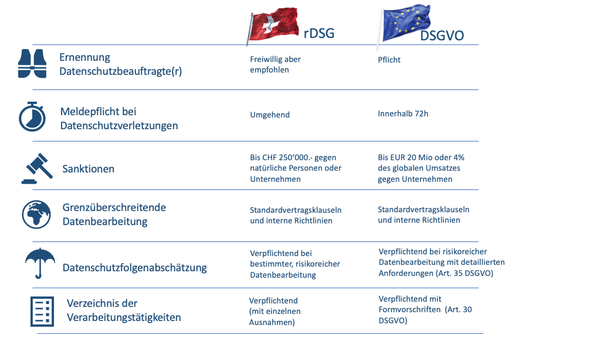

---
keywords:
  - pdf
---
# EU DSGVO
:::note
Welche Gesetzte gibt es in der EU zum Thema Datenschutz und was beeuten diese für uns als Informatiker.
:::

  
 🎉 Celebration Criteria

**Kategorisiert Daten aufgrund ihres Schutzbedarfs.**

Kennt verschiedene Rechtsräume (Schweiz, EU).

Kennt für den jeweiligen Rechtsraum die juristischen Werke (z. B. DSG, DSGVO).

**Überprüft eingesetzte Anwendungen auf Einhaltung der Datenschutzgesetze.**

Kennt wesentliche Unterschiede in den Datenschutzgesetzen der verschiedenen Rechtsräume.

**Zeigt Konsequenzen von Fehlern im Datenschutz und bei der Datensicherheit auf.**

Kennt die Problematik von Datenlöschungen über alle Archive und Backups.

  
 🤔 Leitfragen 

- Wer muss sich an das Gesetz halten?
- Wer ist unter dem Gesetzt geschützt?
- Was ist ein Juristiesch respektive Naturliche Person?
- Welche Daten sind geschützt?
- Was sind besonders schützenswerte Daten?
- Was muss bei besonders schützenswerte Daten beachte werden?
- Was ist eine Datensammlung?
- Welche Rechte hat eine Betroffen Person?
- Wie kann ich als betroffene Person gebauch vom Gesetzt machen?
- Welche Pflichten hat eine Firma oder öffentliche Institution?
- Was sind die Konsequenzen von verstössen?
- Was sind die Unterschiede der Gesetzte?
- Was bedeute das Gesetzt für euch als Mitarbeiter, IT Mitarbeiter respektive Entwickler?
- Was ist privacy by design und privacy by default?
- Was bedeute das Gesetz bei der Evaluation von Anwendungen?
- Was für Problem können bei SAAS (Cloud) Anwedungen entstehen?
- ...

  
 🤫 Quellen für die Uninspierierten

- [**CH Admin EDÖB:** DSGVO](https://www.edoeb.admin.ch/edoeb/de/home/dokumentation/datenschutz/Datenschutz%20-%20International/DSGVO.html)

- [**EU:** DSGVO](https://eur-lex.europa.eu/legal-content/DE/TXT/HTML/?uri=CELEX:32016R0679)

- [**PWC:** EU-DatenschutzGrundverordnung
(GDPR)](https://www.pwc.ch/en/publications/2018/eu-datenschutzgrundverordnung-gdpr-d-web.pdf)

- [**BARC GmbH:** Vergleich Schweiz vs. EU](https://barc.com/de/unterschiede-schweizer-datenschutzgesetz-dsgvo/)

___

## Information

### Gesetzt der EU
[Datenschutz Grundverordnung](https://eur-lex.europa.eu/legal-content/DE/TXT/HTML/?uri=CELEX:32016R0679) 

#### Rechte von Betroffenen
Art. 15 Auskunftsrecht
> Verarbeitungszweck; Kategorien der verarbeiteten Daten; (beabsichtigte) Empfänger der Daten;
> geplante Speicherdauer oder die Kriterien, wie diese festgelegt wird;
> Bestehen eines Rechts auf Berichtigung/Löschung der Daten sowie auf Einschränkung/Widerspruch der Verarbeitung;
> Herkunft der Daten, wenn sie nicht bei dem Betroffenen erhoben wurden;
> Bestehen eines automatisierten Entscheidungsverfahrens (inkl. Profiling) sowie dessen Logik und Zweck.
> Geeignete Garantien (z. B. Zertifizierungen), wenn Daten an Drittland oder internationale Organisation übermittelt werden.

- Art. 16 Recht auf Berichtigung
- Art. 17 Recht auf Löschung
- Art. 18 Recht auf Einschränkung der Verarbeitung
- Art. 20 Recht auf Datenübertragbarkeit
- Art. 21 Widerspruchsrecht
- Art. 22 Automatisierte Entscheidungen im Einzelfall einschließlich Profiling
- Art. 23 Beschränkungen

#### Pflicht von Unternehmen
- Art. 5 Grundsätze für die Verarbeitung personenbezogener Daten
- Art. 6 Rechtmäßigkeit der Verarbeitung
- Art. 7 Bedingungen für die Einwilligung
- Art. 8 Bedingungen für die Einwilligung eines Kindes in Bezug auf Dienste der Informationsgesellschaft 
- Art. 9 Verarbeitung besonderer Kategorien personenbezogener Daten
- Art. 10 Verarbeitung von personenbezogenen Daten über strafrechtliche Verurteilungen und Straftaten
- Art. 11 Verarbeitung, für die eine Identifizierung der betroffenen Person nicht erforderlich ist

#### Vergleich CH vs. EU

:paperclip: [Bildquelle](https://www.pragmatica.ch/revidiertes-datenschutzgesetz/)

