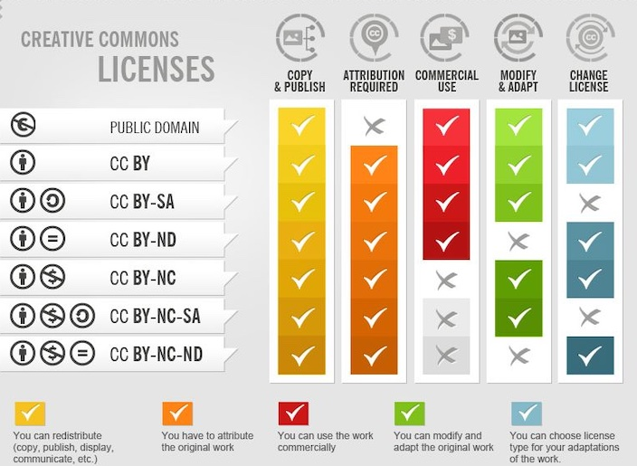
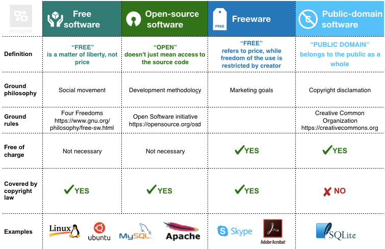
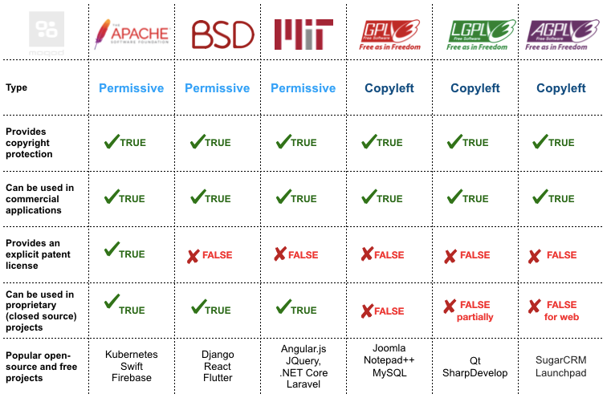

---
keywords:
  - pdf
---
# Lizenzen
:::note
Was ist eine Lizenz?
:::

  
 🎉 Celebration Criteria

**Wählt Software für die Einhaltung von Datenschutz und Datensicherheit aufgrund der Lizenzmodelle aus.**

Kennt verschiedene Lizenzmodelle (z.B. für Software, Texte, Bilder).

  
 🤫 Quellen für die Uninspierierten

**Allgemein**

- [**Business Systemhaus AG:** Was ist eine Lizenz?](https://bsh-ag.de/it-wissensdatenbank/lizenz/)

**Bilder**

- [**Schweizerische Kriminalprävention:** Das eigene Bild](https://www.skppsc.ch/de/wp-content/uploads/sites/2/2016/12/rechteigenesbild.pdf)

- [**ifolor:** Bildrechte in der Schweiz](https://www.ifolor.ch/inspirationen/bildrechte-der-schweiz)

- [**VERTRAGSHILFE:** Das Recht am eigenen Bild in der Schweiz](https://www.vertragshilfe.ch/recht-am-eigenen-bild/)

- [**beobachter:** Jedes Foto ist geschützt](https://www.beobachter.ch/gesetze-recht/schweizer-urheberrecht-wie-sind-fotos-videos-und-andere-kunstlerische-werke-geschutzt-39499)

- [**IGE:** Wie darf ich eine Fotografie nutzen?](https://www.ige.ch/de/etwas-schuetzen/urheberrecht/ein-werk-nutzen/fotografienschutz)

- [**Creative Commons:** Was ist Creative Commons?](http://www.creativecommons.ch/wie-funktionierts/)

**Software**

- [**Thales:** Software-Lizenzmodelle](https://cpl.thalesgroup.com/de/software-monetization/software-license-models)

- [**Institut für Rechtsfragen der Freien und Open Source Software:** Welches sind die wichtigsten Open Source Lizenzen und welchem Lizenztyp gehören sie an?](https://www.ifross.org/welches-sind-wichtigsten-open-source-lizenzen-und-welchem-lizenztyp-gehoeren-sie)

- [**BREKOM:** Softwarelizenz](https://www.computerweekly.com/de/definition/Softwarelizenz)

- [**Rentsch Partner AG:** Schutz Software](https://www.rentschpartner.ch/ict-law/schutz-von-software)

___

## Information
### Bilder
#### Sind Bilder Urheberrechtlich geschützt?
> Das Urheberrecht schützt sämtliche Fotografien und ähnlich wie Fotografien hergestellte Abbildungen, die physisch vorhandene dreidimensionale Objekte abbilden und von Menschen gemacht wurden. 

> Der Schutz besteht unabhängig davon, ob die Fotografien individuellen Charakter aufweisen oder nicht. Geschützt sind sowohl Fotografien von professionellen Fotografen als auch die Fotografien von Laien, also beispielsweise Presse- und Produktbilder ebenso wie alltägliche Familien- und Urlaubsfotos.

Quelle: https://www.ige.ch/de/etwas-schuetzen/urheberrecht/ein-werk-nutzen/fotografienschutz

#### Welche Kommerziellen Lizenzen gibt es?

- Klassische Lizenzverträge (Rights-Managed Lizenz)
Der Nuten des Bilds wird definiert und einen entsprechenden Preis für diese Nutzung Abgemacht.

- “lizenzfreie Bilder” (Royalty-Free Lizenz)
Üblicherweise bei Online Agenturen, das Bild darf dann auch nur für einen Bestimmen zweck und Auflage verwendet werden.
Oft auf ein Projekt beschrenkt. Die Bilder sind auch nicht exklusive und durch die höher Auflage dann auch günster.

#### Welche freien Lizenzen gibt es?

#### Recht am eigen Bild

Ein Bild mit einer klar erkennbaren Person, welche im Fokus steht, darf nicht ohne Einwilligung veröffentlicht werden.
Wen das Öffentliche Interesse überwiegt, gibt es Ausnahmen.

Quelle: https://www.skppsc.ch/de/wp-content/uploads/sites/2/2016/12/rechteigenesbild.pdf

___
### Software
#### Open Source

Quelle: https://moqod-software.medium.com/understanding-open-source-and-free-software-licensing-c0fa600106c9

#### Kommerzielle Lizenzen
- Unbefristete Lizenzierung -> Kunde die Software einmalig
- Concurrent-User-Lizenzen -> mehrere Benutzer einen Lizenzcode
- Abonnement-basierte Lizenzierung
- Proprietäre Lizenzierungsmodelle -> z.B. Microsoft Windows oder Office
- Floating-Feature-Lizenzmodell -> gleichzeitige Nutzung bestimmter Features durch Benutzer einschränken
- Feature-basiertes Lizenzierungsmodell 
- Netzwerklizenzierung -> Lizenz wird an einem Lizenz Server im Netzwerk geprüft
- Cloud-basierte Lizenzierung -> Paas Dienste z.B. Salesforce
Quelle: https://cpl.thalesgroup.com/de/software-monetization/software-license-models