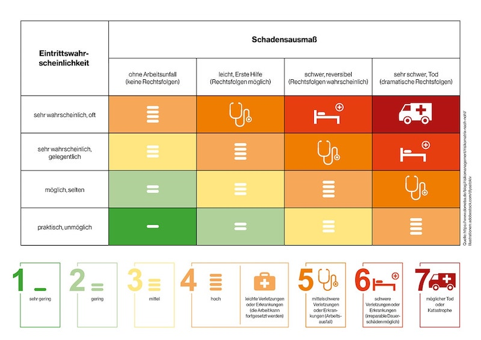

---
keywords:
  - pdf
---

# Sicherheit und Risiko

Was ist Sicherheit und Risiko?

## 🎉 Celebration Criteria

  - :dart: Sie kennen die Unterschiede zwischen Security und Safety.
  - :dart: Sie kennen die Grundlagen vom Risikomanagement.

## :compass: Wegweiser

  
 🤔 Leitfragen 

- Was ist Security?
- Was ist Safety?
- Was ist der Unterschiede zwischen Security und Safety?
- Was ist Risiko?
- Wie kann es erhoben werden?
- Wie kann es gewichtet werden?
- Wie kann man es minderen?
- Wann ist es akzeptable?
-...

  
 ℹ️ Quellen für die Recherche

- [**Sichere Industrie:** Safety vs. Security...](https://www.sichere-industrie.de/safety-security-unterschied-erklaert-kombination-ziele-industrial-security/)

- [**CH Admin:** Risikomanagement](https://www.kmu.admin.ch/kmu/de/home/praktisches-wissen/finanzielles/risikomanagement.html)

- [**CH Admin:** Risikoidentifikation und Risikobewertung](https://www.kmu.admin.ch/kmu/de/home/praktisches-wissen/finanzielles/risikomanagement/wie-fuehrt-man-ein-risikomanagementsystem-ein/risikoidentifikation-und-risikobewertung.html)

___
## Sicherheit

### Was ist Sicherheit?

> «Sicherheit bezeichnet einen Zustand, der frei von  unvertretbaren Risiken der Beeinträchtigung ist oder als gefahrenfrei angesehen wird.»

(DIN EN 61508)

### Was ist der Unterschied zwischen Security und Safety?

**Safety**

Primäres Schutzziel =  Lebewesen

**Security**

Primäres Schutzziel =  Objekte

## Risiko
Das Risiko ist ein Mass für die Grösse einer Gefährdung und beinhaltet die Häufigkeit bzw. Wahrscheinlichkeit und das Schadensausmass eines unerwünschten Ereignisses.

- Eintrittswahrscheinlichkeit (auch Schadenswahrscheinlichkeit, Schadenshäufigkeit)
- Schadenspotenzial, Schadensausmass

Eintrittswahrscheinlichkeit * Schadensausmass = Risiko

### Eintrittshäufigkeit

| Eintrittshäufigkeit | Beschreibung                     |
| :------------- | :-------------------------------------------- |
| selten | Ereignis könnte nach heutigem Kenntnisstand höchstens alle 5 Jahre eintreten. |
| mittel | Ereignis tritt einmal alle fünf Jahre bis einmal im Jahr ein. |
| häufig | Ereignis tritt einmal im Jahr bis einmal pro Monat ein. |
| sehr häufig | Ereignis tritt mehrmals im Monat ein. |

### Schadenshöhe

| Schadenshöhe | Schadensauswirkungen                     |
| :------------- | :-------------------------------------------- |
| vernachlässigbar | Die Schadensauswirkungen sind gering und können vernachlässigt werden.  |
| begrenzt | Die Schadensauswirkungen sind begrenzt und überschaubar |
| beträchtlich | Die Schadensauswirkungen können beträchtlich sein.  |
| existenzbedrohend | Die Schadensauswirkungen können ein existenziell bedrohliches, katastrophales Ausmass erreichen.  |

### Risikokategorien
| Risikokategorien | Beschreibung                     |
| :------------- | :-------------------------------------------- |
| gering  | Die bereits umgesetzten oder zumindest im Sicherheitskonzept vorgesehenen Sicherheitsmaßnahmen bieten einen ausreichenden Schutz. In der Praxis ist es üblich, geringe Risiken zu akzeptieren und die Gefährdung dennoch zu beobachten.   |
| mittel  | Die bereits umgesetzten oder zumindest im Sicherheitskonzept vorgesehenen Sicherheitsmaßnahmen reichen möglicherweise nicht aus.  |
| hoch  | Die bereits umgesetzten oder zumindest im Sicherheitskonzept vorgesehenen Sicherheitsmaßnahmen bieten keinen ausreichenden Schutz vor der jeweiligen Gefährdung.   |
| sehr hoch | Die bereits umgesetzten oder zumindest im Sicherheitskonzept vorgesehenen Sicherheitsmaßnahmen bieten keinen ausreichenden Schutz vor der jeweiligen Gefährdung. In der Praxis werden sehr hohe Risiken selten akzeptiert.   |
