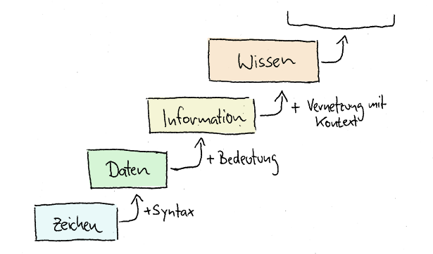

---
keywords:
  - pdf
---
# Informationssicherheit
:::note
Was ist Informationssicherheit ?
:::

  
 🎉 Celebration Criteria

Sie kennen die unterschiedlichen Arten von Informationen.

Sie kennen die Grundlage vom Informationssicherheit.

  
 🤫 Quellen für die Uninspierierten

- [**Security Insider:** Was ist Informationssicherheit?](https://www.security-insider.de/was-ist-informationssicherheit-a-677316/)

- [**BREKOM:** Informationssicherheit](https://brekom.de/ratgeber-it-sicherheit/informationssicherheit/)

- [**NCSC:** Bundesinterne Kampagne](https://www.ncsc.admin.ch/ncsc/de/home/dokumentation/bundesinterne-kampagnen.html)

- [**MATRIX IT development Gmbh:** Begriffe und Definitionen](https://www.matrix-development.de/risikomanagement_definition.html)

___
## Einstig in Informationssicherheit

### Was sind Informationen?

> „Informationen stellen Kenntnisse über Sachverhalte oder Personen dar.“

[**artegic AG:** Wo liegt der Unterschied zwischen Daten, Informationen und Wissen?](https://www.artegic.com/de/blog/wo-liegt-der-unterschied-zwischen-daten-informationen-und-wissen/)

### Daten und Informationen im Kontext

[]

[**vis4.net:** Datavis vs. Infovis - Zwischen Kunst und Journalismus](https://www.vis4.net/blog/2010/11/datavis-vs-infovis/)

### Was ist Informationssicherheit?

> Schutz von Informationen in jeder Form, egal ob auf Papier oder digital. 

**CIA**

- Confidentiality (Vertraulichkeit)
- Integrity (Integrität) 
- Availability (Verfügbarkeit)

**Vertraulichkeit**

- Daten sind vertraulich zu behandeln
- Nur autorisierte Personen haben Zugriff
- Das ist bei Daten im Zugriff, im Transfair und im Ruhezustand zu gewährleisten

**Integrität**

- Datenintegrität: Daten sind korrekt, vollständig und konsistent
- Systemintegrität: System funktioniert zu jedem Zeitpunkt wie vorgesehen

**Verfügbarkeit**

- Daten sind verfügbar
- Üblicherweise in Service-Level-Agreements geregelt
