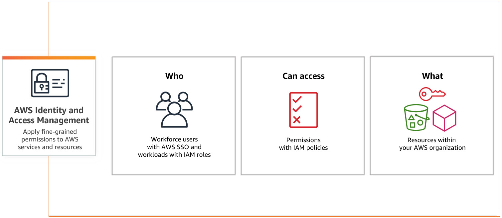
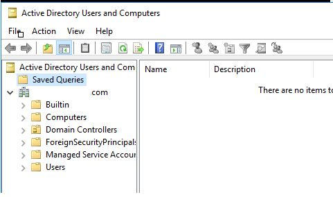

---
keywords:
  - pdf
---

# Identity und Access Management

:::note
Wer darf was machen?
:::

<details>
  <summary>
    🎉 Celebration Criteria
  </summary>

**Überprüft und verbessert gegebenenfalls die Datensicherheit der eigenen Infrastruktur.**

Kennt Techniken des Zugriffsschutzes, Passwortmanager und Prinzipien der Passwortverwaltung. - Sie wissen was ein "sicheres Passwort" ausmacht. - Sie kennen alternativen und ergänzungen zu Passwörter. - Sie kennen die Limitationen von Passwörter und MFA. - Sie kennen die Grundlagen von RBAC. - Sie wissen wo RBAC in IAM Einzuordnen ist. - Sie wissen was Least Privileged Access (LPA) ist.

Kennt den Unterschied von Authentifizierung und Autorisierung.

</details>

<details>
  <summary> 
    🤔 Leitfragen 
  </summary>

- Was ist IAM?
- Was ist Authentifizierung?
- Was ist Autorisierung?
- Was ist ein Sicher Passwort ?
- Was ist sind die grenzen von Passwörter?
- Welche Modernen Auth Methoden gibt es? (MFA, Passkey, Biometrische Daten, etc..)
- Wie kann ein Passwort sicher Aufbewahrt werden?
- Wie sieht das mit Post Quanten Kryptographie aus?
- Was ist Least Privileged Access (LPA)?
- Was sind gute Grundsätze für eine Berechtigungskonzept?
- Was ist RBAC und wie ist es in IAM Einzuordnen?
- ...

</details>

<details>
  <summary> 
    🤫 Quellen für die Uninspierierten
  </summary>

- [**ComputerWeekly.de:** Identity Access Management (IAM) -Systeme](https://www.computerweekly.com/de/definition/Identity-Access-Management-IAM-Systeme)

- [**Microsoft** Was ist Identity & Access Management (IAM)?](https://www.microsoft.com/de-de/security/business/security-101/what-is-identity-access-management-iam)

- [**Okta:** Vergleich von Authentifizierung und Autorisierung](https://www.okta.com/de/identity-101/authentication-vs-authorization/#:~:text=Durch%20Authentifizierung%20wird%20best%C3%A4tigt%2C%20dass,Erlaubnis%20erhalten%2C%20auf%20Ressourcen%20zuzugreifen.)

- [**auth0:** Authentication vs. Authorization](https://auth0.com/docs/get-started/identity-fundamentals/authentication-and-authorization)

- [**CH Admin bit:** How To Choose a Strong Password](https://www.bit.admin.ch/bit/de/home/dokumentation/kundenzeitschrift-eisbrecher/eisbrecher-archiv/kundenzeitschrift-eisbrecher-ausgabe-75/self-service.html)

- [**TechTarget:** strong password](https://www.techtarget.com/searchenterprisedesktop/definition/strong-password)

- [**Boston University:** How To Choose a Strong Password](https://www.bu.edu/tech/support/information-security/security-for-everyone/how-to-choose-a-strong-password/)

- [**tools4ever** Was ist Multi-Faktor-Authentifizierung?](https://www.tools4ever.de/glossar/was-ist-multi-faktor-authentifizierung/)

- [**securityinsider** Was ist Multi-Faktor-Authentifizierung (MFA)?](https://security-insider.de/was-ist-multi-faktor-authentifizierung-mfa-a-631486/)

- [**ionos:** Role Based Access Control (RBAC): Wie funktioniert die rollenbasierte Zugriffskontrolle?](https://www.ionos.de/digitalguide/server/sicherheit/was-ist-role-based-access-control-rbac/)

- [**youtube.com:** Role-Based Access Control (RBAC) Explained: How it works and when to use it](https://www.youtube.com/watch?v=4Uya_I_Oxjk)

- [**microsoft:** Azure Role-Based Access Control, Azure RBAC)?](https://learn.microsoft.com/de-de/azure/role-based-access-control/overview)

</details>

---

## Einstig in Identity und Access Management

### Was ist IAM?



**Identity**

- Identität
- Wer?
  - ein Person welches sich via User, Password und MFA Authentifiziert
  - ein System das sich via Zertifikat oder Key Authentifiziert

**Access**

- Zugriff
- Was?
  - legt fest auf was, wie zugegriffen werden darf oder eben nicht

### Berechtigungen

| Identity    | Resource                  | Access               |
| :---------- | :------------------------ | :------------------- |
| Hans Müller | Internet                  | allowed to google.ch |
| FC_read     | \\FileServer001\Finanzen$ | read                 |
| FC_write    | \\FileServer001\Finanzen$ | write                |
| HR_read     | \\FileServer001\HR$       | read                 |
| HR_write    | \\FileServer001\HR$       | read                 |

### Least Privileged Access

User und System haben nur zugriff auf das was Notwenig ist um ihren Job zuerledigen.
z.B. Der/ Die Service Desk Mitarbeiter:in hat keinen Domain Admin, sondern nur Password Reset Rechte.

**ohne**

| Identity | Resource                  | Access |
| :------- | :------------------------ | :----- |
| FC       | \\FileServer001\Finanzen$ | full   |
| HR       | \\FileServer001\HR$       | full   |

**mit**

| Identity                | Resource                             | Access |
| :---------------------- | :----------------------------------- | :----- |
| FC_Debitoren_read       | \\FileServer001\Finanzen$\Debitoren  | read   |
| FC_Debitoren_write      | \\FileServer001\Finanzen$\Debitoren  | write  |
| FC_Kreditoren_read      | \\FileServer001\Finanzen$\Kreditoren | read   |
| FC_Kreditoren_write     | \\FileServer001\Finanzen$\Kreditoren | write  |
| HR_Loehne_read          | \\FileServer001\HR$\Löhne            | read   |
| HR_Loehne_write         | \\FileServer001\HR$\Löhne            | write  |
| HR_Bewerbungen_read     | \\FileServer001\HR$\Bewerbungen      | read   |
| HR_Bewerbungen_HR_write | \\FileServer001\HR$\Bewerbungen      | write  |

### Verzeichnis Dienst



## Authentifizierung und Autorisierung

[](https://www.okta.com/de/identity-101/authentication-vs-authorization/)

### Authentifizierung: Identität nachweisen

- Prüft Anmeldeinformation
- Passwörter
- Biometrische Daten
- Pin
- MFA APP
- Hardware Token

### Autorisierung: Rechte Vergabe

- Ordnet bestimmte Rechte einer Identität zu
  - Server
  - Admin Rechte
  - FileShare
  - Zugriff auf bestimmtes APP

## Passwörter und MFA

### Was ist eine sicheres Passwort?

```mdx-code-block
<YouTube id="TvrFpAFitQ0" title="Free Security Awareness Chapter 4 - How To Create a Strong Password // Wizer - Security Awareness Training" />
```

### Was ist MFA?

```mdx-code-block
<YouTube id="xCCni1Sxe80" title="So funktioniert die Zwei-Faktor-Authentisierung // BSI" />
```

### Kuze Zusammenfassung

```mdx-code-block
<YouTube id="pxZH67w4PHY" title="Authentication Factors Explained: 2FA, MFA, TOTP // Intellectual Point" />
```

