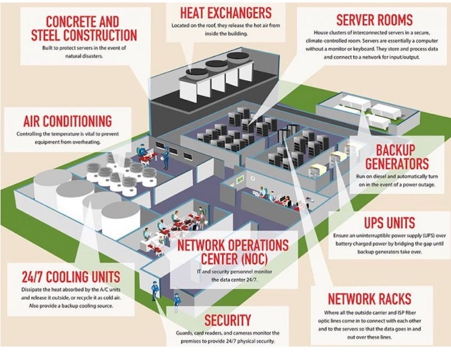

# Physische Sicherheit
:::note
Keep your hands out of the cookie jar!!
:::

  
 🎉 Celebration Criteria

Sie kennen Physische Massnahmen zum Schutz von Daten und IT Systemen.

  
 🤫 Quellen für die Uninspierierten

- [**ComputerWeekly:** Physische Sicherheit (Objektschutz)](https://www.computerweekly.com/de/definition/Physische-Sicherheit-Objektschutz)

- [**security insider:** Was ist physische IT-Sicherheit?](https://www.security-insider.de/was-ist-physische-it-sicherheit-a-712152/)

- [**green** Schutz im Datacenter](https://www.green.ch/de/geschaeftskunden/security/physische-sicherheit/schutz-im-datacenter)

___
## Einstig in Physische Sicherheit / Objekt Schutz im IT Kontext

### Was sind Physische Massnahmen?
> Schutz der Assets auch Personen von aüssern Gefahren und Ereignissen.
> Mann redet auch von Objektschutz.

**Gefahren:**
- Schutz vor Feuer
- Naturkatastrophen (Blitzschlag, Wasser, Erdbeben)
- Einbrüchen, Diebstahl
- Sabotage, Vandalismus und Terrorismus

**Massnahmen**
- Löschanlage mit Wasser oder GAS
- USV Batterie oder Generator 
- Kühlung
- Zutrittskontrolle mit Bag, Iris, Fingerprint, Schlüssel
    - Vereinzelungsschleuse
    - Protokollierung
- Überwachungskameras
- Alarmanlage
- Abschliessbar Racks
- Geo Redundanz

### Bsp. Daten Center

