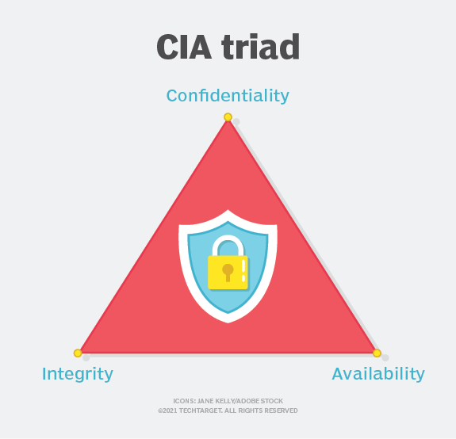

<!-- _class: big center -->
# Informationssicherheit
## Modul 231

---

# Was sind Informationen?

> „Informationen stellen Kenntnisse über Sachverhalte oder Personen dar.“

[**artegic AG:** Wo liegt der Unterschied zwischen Daten, Informationen und Wissen?](https://www.artegic.com/de/blog/wo-liegt-der-unterschied-zwischen-daten-informationen-und-wissen/)

---

# Daten und Informationen im Kontext

[]

[**vis4.net:** Datavis vs. Infovis - Zwischen Kunst und Journalismus](https://www.vis4.net/blog/2010/11/datavis-vs-infovis/)

---

# Daten in der IT

---

# Was ist Informationssicherheit?

> Schutz von Informationen in jeder Form, egal ob Papier oder Digital. 

---

::: columns
# CIA  

- Confidentiality (Vertraulichkeit)
- Integrity (Integrität) 
- Availability (Verfügbarkeit)

::: split

:::

---
::: columns
## Vertraulichkeit

- Daten sind vertraulich zu behandelt
- Nur autorisierten Personen haben Zugriff
- Das ist bei Daten im Zugriff, im Transfair und im Ruhezustand zu gewährleisten

::: split

:::

---
::: columns
## Integrität

- Datenintegrität: Daten sind Korrekt, Vollständig und Konsistent
- Systemintegrität: System Funktioniert zu jedem Zeitpunkt wie vorgesehen

::: split

:::

---
::: columns
## Verfügbarkeit

- Daten sind Verfügbar
- Üblicherweise in Service-Level-Agreements geregelt

::: split

:::
