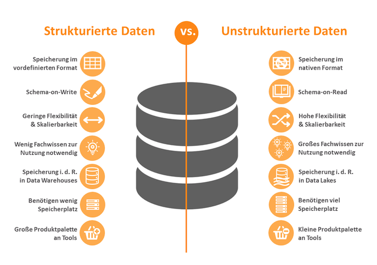
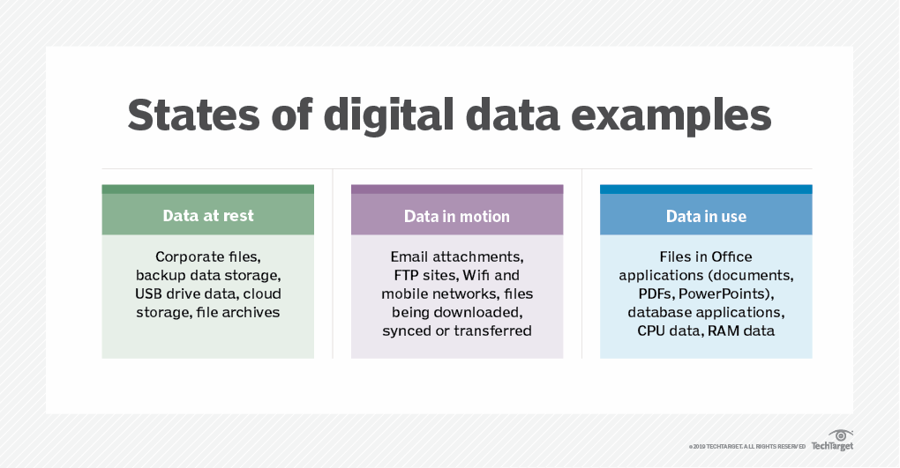

<!-- _class: big center -->
### Grundlagen
# Daten
## Modul 231

---

# Was sind Daten?

> „Daten im IT Kontext sind Information welche in“

[**artegic AG:** Wo liegt der Unterschied zwischen Daten, Informationen und Wissen?](https://www.artegic.com/de/blog/wo-liegt-der-unterschied-zwischen-daten-informationen-und-wissen/)

---

# Welche Arten von Daten gibt es?

---

# Zustand von Daten

