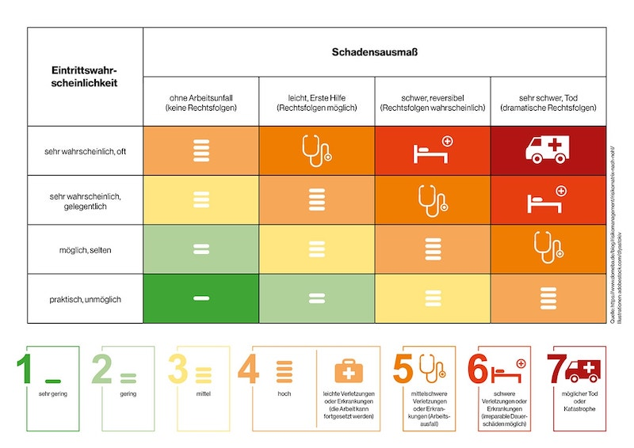
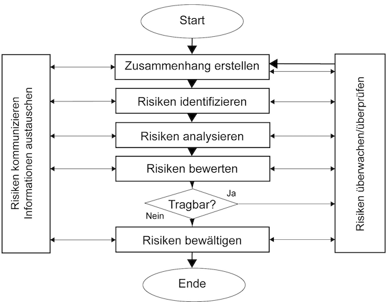

<!-- _class: big center -->
### Grundlagen
# Sicherheit und Risiko
## Modul 231

---

# Was ist Sicherheit?

> «Sicherheit bezeichnet einen Zustand, der frei von  unvertretbaren Risiken der Beeinträchtigung ist oder als gefahrenfrei angesehen wird.»

(DIN EN 61508)

---

# Was ist der Unterschied zwischen Security und Safety?

::: columns
## Security

Primäres Schutzziel =  Lebewesen

::: split

## Safety

Primäres Schutzziel =  Objekte

:::

---

# Was ist Risiko?
Eintrittswahrscheinlichkeit x Schadensschwere = Risiko

---

---
# Was ist Risikomanagement?

