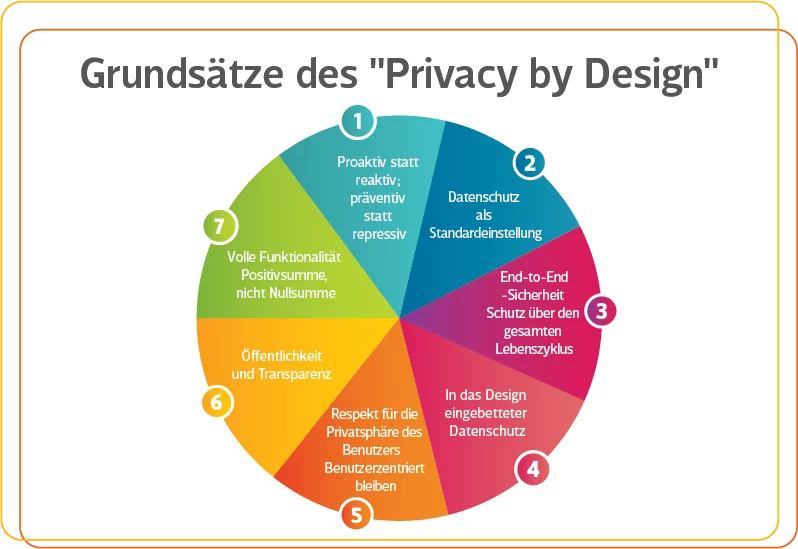
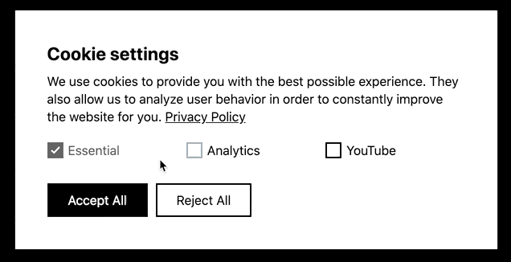

<!-- _class: big center -->
### Datenschutz
# Allgemein
## Modul 231

---
# Was ist Datenschutz?
> Gesetzliche vorschriften zum Schutz von personenbezogen Daten.

---
# Was ist das Ziel des Datenschutzes?
> Das die Privatsphäre von Naturlichenperson bei der Verarbeitung von Daten respektiert wird.

---
# Was ist "privacy by design"?
> Der Datenschutz als Design Grundsatz beim Planen und Umsetzten von Infrastruktur und Software genommen.
> z.B. werden nur die absolut notwenigen Daten erhoben

---

---
# Was ist "privacy by default"?
> Wen es eine Wahl gibt wird die Datenschutz freundlichst Variante als Standart gesetzt. 
> z.B. Cookies etc. bei den Webseiten

