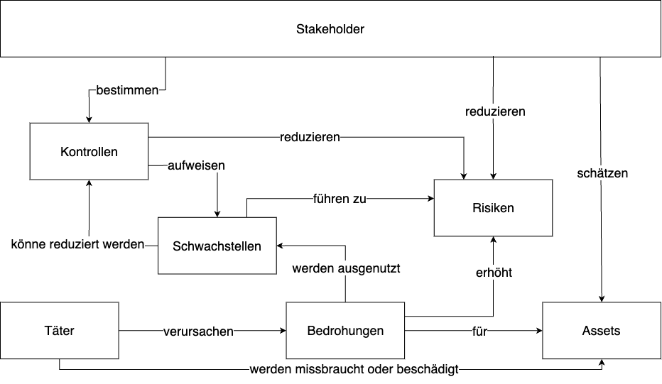
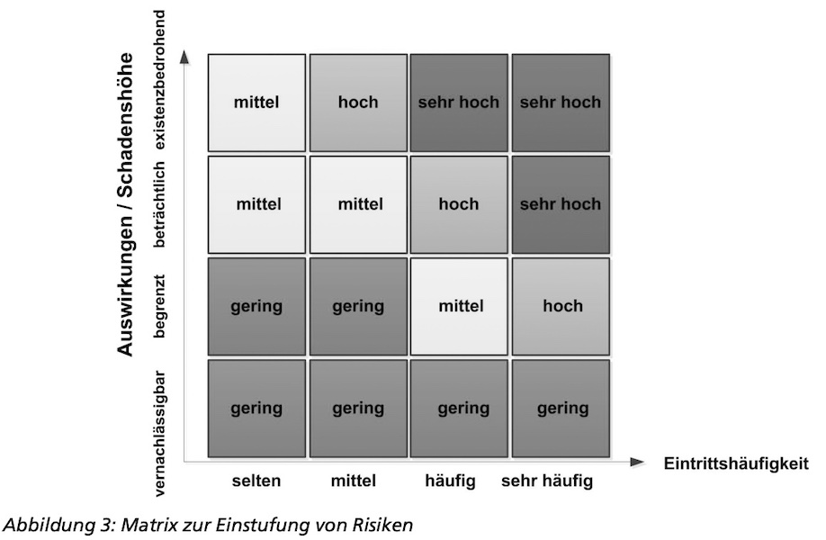

<!-- _class: big center -->
### Datensicherheit
# Begriffe
## Modul 231

---
# Übersicht der Begriffe

---
# Asset
Vermögenswert eines Unternehmens

---
# Schwachstelle
Schwachstellen (vulnerability, bug) 

---
# Bedrohung
Ereignis das die Verfügbarkeit, Integrität oder Vertraulichkeit von Informationen beeinträchtigen

---
# Risiko
Das Risiko ist ein Mass für die Grösse einer Gefährdung und beinhaltet die Häufigkeit
bzw. Wahrscheinlichkeit und das Schadensausmass eines unerwünschten Ereignisses.
::: columns

- Eintrittswahrscheinlichkeit (auch Schadenswahrscheinlichkeit, Schadenshäufigkeit)
- Schadenspotenzial, Schadensausmass

Eintrittswahrscheinlichkeit * Schadensausmass = Risiko

::: split

:::

---
# Eintrittshäufigkeit

| Eintrittshäufigkeit | Beschreibung                     |
| :------------- | :-------------------------------------------- |
| selten | Ereignis könnte nach heutigem Kenntnisstand höchstens alle 5 Jahre eintreten. |
| mittel | Ereignis tritt einmal alle fünf Jahre bis einmal im Jahr ein. |
| häufig | Ereignis tritt einmal im Jahr bis einmal pro Monat ein. |
| sehr häufig | Ereignis tritt mehrmals im Monat ein. |

---

# Schadenshöhe

| Schadenshöhe | Schadensauswirkungen                     |
| :------------- | :-------------------------------------------- |
| vernachlässigbar | Die Schadensauswirkungen sind gering und können vernachlässigt werden.  |
| begrenzt | Die Schadensauswirkungen sind begrenzt und überschaubar |
| beträchtlich | Die Schadensauswirkungen können beträchtlich sein.  |
| existenzbedrohend | Die Schadensauswirkungen können ein existenziell bedrohliches, katastrophales Ausmass erreichen.  |

---

---
# Risikokategorien
| Risikokategorien | Beschreibung                     |
| :------------- | :-------------------------------------------- |
| gering  | Die bereits umgesetzten oder zumindest im Sicherheitskonzept vorgesehenen Sicherheitsmaßnahmen bieten einen ausreichenden Schutz. In der Praxis ist es üblich, geringe Risiken zu akzeptieren und die Gefährdung dennoch zu beobachten.   |
| mittel  | Die bereits umgesetzten oder zumindest im Sicherheitskonzept vorgesehenen Sicherheitsmaßnahmen reichen möglicherweise nicht aus.  |

---
| | |
| :------------- | :-------------------------------------------- |
| hoch  | Die bereits umgesetzten oder zumindest im Sicherheitskonzept vorgesehenen Sicherheitsmaßnahmen bieten keinen ausreichenden Schutz vor der jeweiligen Gefährdung.   |
| sehr hoch | Die bereits umgesetzten oder zumindest im Sicherheitskonzept vorgesehenen Sicherheitsmaßnahmen bieten keinen ausreichenden Schutz vor der jeweiligen Gefährdung. In der Praxis werden sehr hohe Risiken selten akzeptiert.   |

---
# Exploit
Ein Exploit ist das ausnutzen einer Schwachstelle.

---
# Täter
Person welche Schwachstelle ausnutzt und so eine Bedrohnung für die Assets darstellt.
