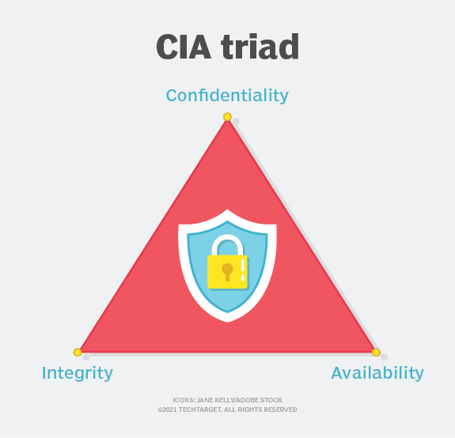

<!-- _class: big center -->
### Datensicherheit
# Klassifizierung und Speicher
## Modul 231

---
::: columns
# CIA  

- Confidentiality (Vertraulichkeit)
- Integrity (Integrität) 
- Availability (Verfügbarkeit)

::: split

:::

---
# Übersicht der Kategorien
| Schutzziel | | | | |
| :--------------------- | :---------------  | :---------------  | :---------------  | :---------------  |
| Vertraulichkeit  | Öffentlich | Intern | Vertraulich | Streng Vertraulich |
| Integrität | | normal | hoch | sehr hoch |
| Verfügbarkeit | | normal | hoch | sehr hoch |

---
# Vertraulichkeit
| Klassifizierung | Beschreibung |
| :----------- | :------------------------------------------------ | 
| Öffentlich | Daten sind für jedermann, auch außerhalb der Firma, zugänglich. | 
| Intern | Interne Daten werden lediglich den eigenen Mitarbeitern zugänglich gemacht. | 
| Vertraulich | Vertraulich definierte Daten sind lediglich einer begrenzten Anzahl an Mitarbeitern zugänglich, z.B Personaldaten, Kundenliste |
|Streng Vertraulich | Streng vertrauliche Daten sind punktuell und ausschließlich bestimmten definierten Personen zugänglich.|

[**www.sec4you.com:** Klassifizierung ISO 27001](https://www.sec4you.com/klassifizierung-iso-27001/)

---
# Integrität, Verfügbarkeit
| Klassifizierung | Beschreibung |
| :----------- | :------------------------------------------------ | 
| normal | Die Schadensauswirkungen sind begrenzt und überschaubar.  | 
| hoch | Die Schadensauswirkungen können beträchtlich sein.  | 
| sehr hoch | Die Schadensauswirkungen können ein existenziell bedrohliches, katastrophales Ausmass erreichen. |

[**Klassifizierung nach BSI** ab Seite 104](https://www.bsi.bund.de/SharedDocs/Downloads/DE/BSI/Grundschutz/BSI_Standards/standard_200_2.pdf?__blob=publicationFile&v=2)

---
# Speicher
| Medium | Beschreibung |
| :----------- | :------------------------------------------------ | 
| HDD |  | 
| SSD |  | 
| externe Festplatte, USB Stick |  |
| NAS, SAN und File Server |  |
| Cloud |  |
