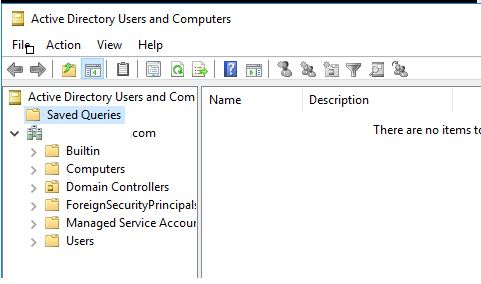

<!-- _class: big center -->
### Identity und Access Management
# Allgemein
## Modul 231

---
# Was ist IAM?

---
::: columns
## Identity
- Identität
- Wer?
    - ein Person welches sich via User, Password und MFA Authentifiziert
    - ein System das sich via Zertifikat oder Key Authentifiziert

::: split

:::

---

::: columns
## Access
- Zugriff
- Was?
    - legt fest auf was, wie zugegriffen werden darf oder eben nicht
    
::: split

:::

---
# Berechtigungen

| Identity | Resource | Access
| :----------- | :----------- | :----------- |
| Hans Müller | Internet | allowed to google.ch |
| FC_read | \\FileServer001\Finanzen$ | read |
| FC_write | \\FileServer001\Finanzen$ | write |
| HR_read | \\FileServer001\HR$ | read | 
| HR_write | \\FileServer001\HR$ | read | 

---
# Least Privileged Access 
User und System haben nur zugriff auf das was Notwenig ist um ihren Job zuerledigen.
z.B. Der/ Die Service Desk Mitarbeiter:in hat keinen Domain Admin, sondern nur Password Reset Rechte.

---
# ohne

| Identity | Resource | Access
| :----------- | :----------- | :----------- |
| FC | \\FileServer001\Finanzen$ | full |
| HR| \\FileServer001\HR$ | full | 

---
# mit

| Identity | Resource | Access
| :----------- | :----------- | :----------- |
| FC_Debitoren_read | \\FileServer001\Finanzen$\Debitoren | read |
| FC_Debitoren_write | \\FileServer001\Finanzen$\Debitoren | write |
| FC_Kreditoren_read | \\FileServer001\Finanzen$\Kreditoren | read |
| FC_Kreditoren_write | \\FileServer001\Finanzen$\Kreditoren | write |
| HR_Loehne_read | \\FileServer001\HR$\Löhne | read | 
| HR_Loehne_write | \\FileServer001\HR$\Löhne | write | 
| HR_Bewerbungen_read | \\FileServer001\HR$\Bewerbungen| read | 
| HR_Bewerbungen_HR_write | \\FileServer001\HR$\Bewerbungen | write | 

---
# Verzeichnis Dienst

