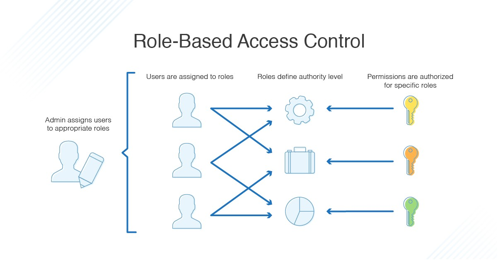

<!-- _class: big center -->
### Identity und Access Management
# RBAC
## Modul 231

---
# Was ist RBAC?

[Gute Erklärung zum Thema](https://www.dnsstuff.com/de/rbac-vs-abac-zugriffskontrolle)
[Video zum Thema](https://www.youtube.com/watch?v=C4NP8Eon3cA)