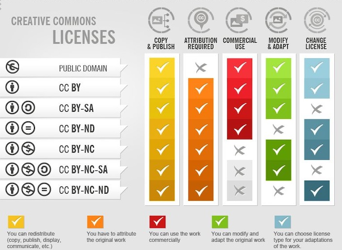

<!-- _class: big center -->
### Lizenzen
# Bilder
## Modul 231

---
# Sind Bilder Urheberrechtlich geschützt?
> Das Urheberrecht schützt sämtliche Fotografien und ähnlich wie Fotografien hergestellte Abbildungen, die physisch vorhandene dreidimensionale Objekte abbilden und von Menschen gemacht wurden. 

> Der Schutz besteht unabhängig davon, ob die Fotografien individuellen Charakter aufweisen oder nicht. Geschützt sind sowohl Fotografien von professionellen Fotografen als auch die Fotografien von Laien, also beispielsweise Presse- und Produktbilder ebenso wie alltägliche Familien- und Urlaubsfotos.

Quelle: https://www.ige.ch/de/etwas-schuetzen/urheberrecht/ein-werk-nutzen/fotografienschutz

---
# Welche Kommerziellen Lizenzen gibt es?

- Klassische Lizenzverträge (Rights-Managed Lizenz)
Der Nuten des Bilds wird definiert und einen entsprechenden Preis für diese Nutzung Abgemacht.

- “lizenzfreie Bilder” (Royalty-Free Lizenz)
Üblicherweise bei Online Agenturen, das Bild darf dann auch nur für einen Bestimmen zweck und Auflage verwendet werden.
Oft auf ein Projekt beschrenkt. Die Bilder sind auch nicht exklusive und durch die höher Auflage dann auch günster.

---
# Welche freien Lizenzen gibt es?

--- 
# Recht am eigen Bild

Ein Bild mit einer klar erkennbaren Person, welche im Fokus steht, darf nicht ohne Einwilligung veröffentlicht werden.
Wen das Öffentliche Interesse überwiegt, gibt es Ausnahmen.

Quelle: https://www.skppsc.ch/de/wp-content/uploads/sites/2/2016/12/rechteigenesbild.pdf