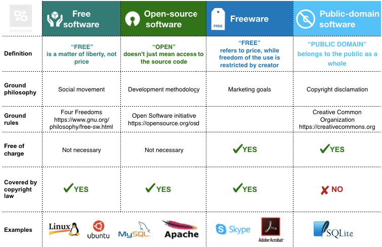
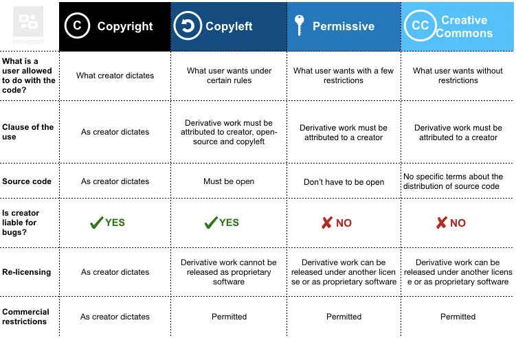

<!-- _class: big center -->
### Lizenzen
# Software
## Modul 231

---
# Open Source

---

---

---
Quelle: https://moqod-software.medium.com/understanding-open-source-and-free-software-licensing-c0fa600106c9

---
# Kommerzielle Lizenzen
- Unbefristete Lizenzierung -> Kunde die Software einmalig
- Concurrent-User-Lizenzen -> mehrere Benutzer einen Lizenzcode
- Abonnement-basierte Lizenzierung
- Proprietäre Lizenzierungsmodelle -> z.B. Microsoft Windows oder Office
- Floating-Feature-Lizenzmodell -> gleichzeitige Nutzung bestimmter Features durch Benutzer einschränken
- Feature-basiertes Lizenzierungsmodell 
- Netzwerklizenzierung -> Lizenz wird an einem Lizenz Server im Netzwerk geprüft
- Cloud-basierte Lizenzierung -> Paas Dienste z.B. Salesforce
Quelle: https://cpl.thalesgroup.com/de/software-monetization/software-license-models