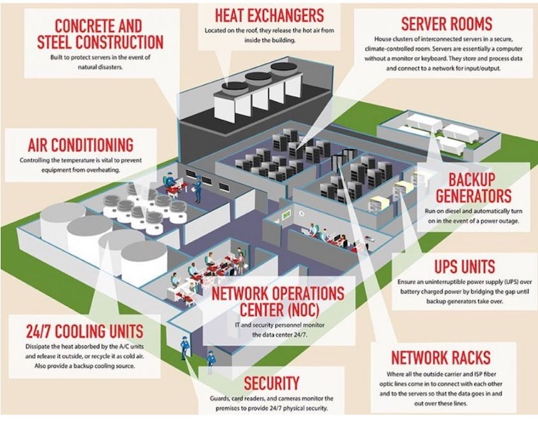

<!-- _class: big center -->
### Massnahmen
# Physische Sicherheit
## Modul 231

---
# Was sind Physische Massnahmen?
> Schutz der Assets auch Personen von aüssern Gefahren und Ereignissen.
> Mann redet auch von Objektschutz.

## Gefahren:
- Schutz vor Feuer
- Naturkatastrophen (Blitzschlag, Wasser, Erdbeben)
- Einbrüchen, Diebstahl
- Sabotage, Vandalismus und Terrorismus

---
## Massnahmen
::: columns
- Löschanlage mit Wasser oder GAS
- USV Batterie oder Generator 
- Kühlung
- Zutrittskontrolle mit Bag, Iris, Fingerprint, Schlüssel
    - Vereinzelungsschleuse
    - Protokollierung

::: split
- Überwachungskameras
- Alarmanlage
- Abschliessbar Racks
- Geo Redundanz

:::

---

