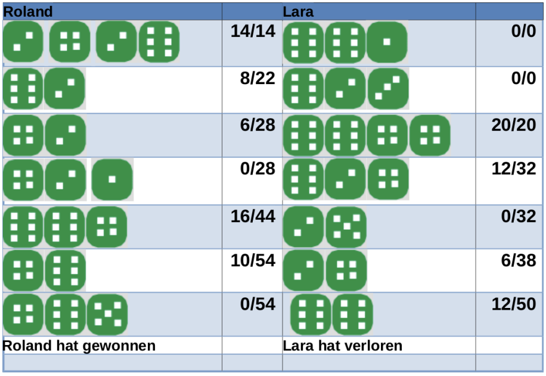
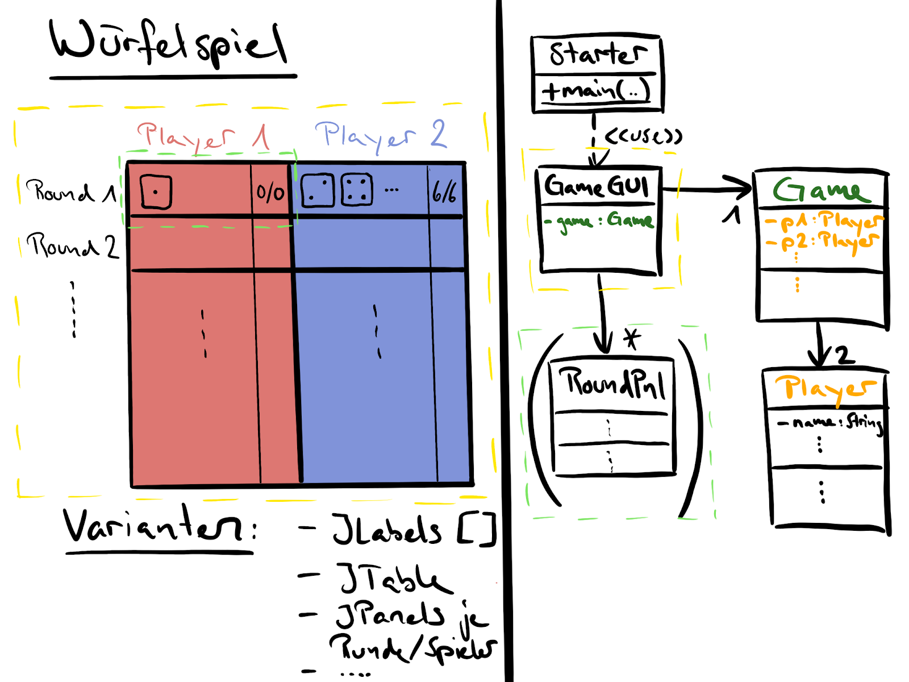

<!-- _class: big center -->

# Woche 6
## Modul 404

---

<!-- _class: big emoji-list -->

# Agenda

- :alembic: Start vom Projekt (LB2)

---

<!-- _class: big -->

# :alembic: Projekt 

## <!--fit--> :book: Bitte studiert nun alle den [Projektbeschrieb](https://codingluke.github.io/bbzbl-modul-404/docs/beurteilungen/lb2)

- Ab jetzt arbeiten wir nur noch am Projekt

---

# :policeman: Spielregeln

- 2 Spieler / X Runden

- 5 Würfe _max_ pro Spieler/Runde
- **Gerader Wurf** aufsummieren
- **Ungerader Wurf** beendet die Runde des Spielers **mit 0**
- Runde darf abgebrochen werden

> :point_up: Die Regeln dürfen abgewandelt werden!

---

# :keyboard: Implementation

**Fachklassen**

- Spieler _(Player)_, Spielregeln _(Game)_, Würfel _(Dice)_

**GameGui**

- Eingabe der Spielernamen
- Darstellung des Spiels
    - ([JPanel](https://codingluke.github.io/bbzbl-modul-404/docs/aufgaben-swing/jpanel), 
    - [JTable](https://sites.google.com/bbzbl-it.ch/modul404-lh/themen/ui/jtable))
- Würfeln / Abbrechen

---

# :pencil: Dokumentation [:book: **Google Docs Dokument**](https://docs.google.com/document/d/1mD7wykSI7ge63gUXXk2SVPEKErBKok09cdiTBuET7VQ/edit)

**:triangular_ruler: Planung**

- Erste **Skizze** und mögliches **Klassendiagram**. Diese müssen nicht dem Endprodukt entsprechen

**:hammer: Implementation**

- **Screenshots** und das **Klassendiagram** des **fertigen Programms** 
- Die einzelnen Klassen sollen kurz erläutert werden

**:mirror: Arbeitsablauf und Reflexion** 

- Reflexion der Arbeit
- Dokumentieren vorhandener Probleme _(nur wenn vorhanden)_
